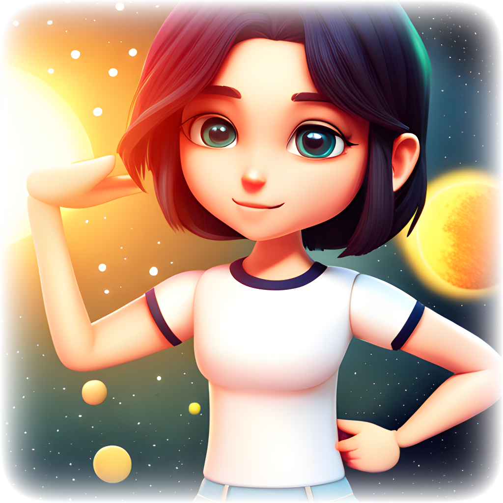

# Sofia's Stellar - A 3D Game



Welcome to Sofia's Stellar, an immersive 3D game developed with Three.js.

## About Sofia's Stellar

Embark on an extraordinary journey into the dream of Sofia, a young girl whose ultimate dream is to become an astronaut. 
However, her ambition has led her to a dream world, and now it's up to us to help her survive this cosmic adventure until she wakes up. Be careful, though; if we don't succeed, we'll destroy her dream forever!

## Features

- **Immersive 3D Environment:** Explore a space crafted 3D world filled with stars, asteroids, sun and a black hole.

- **Survival Challenges:** Encounter various challenges and obstacles that test your skills and decision-making abilities.

- **Resource Gathering:** Collect vital resources scattered throughout the dream world to help Sofia survive and progress.

- **Time Limit:** Sofia's dream won't last forever. Race against time to ensure she wakes up with her dream intact.

## Gameplay

Sofia's Stellar is designed for an engaging and immersive gaming experience. To play the game, follow these steps:

1. **Installation:**
   - Follow the installation instructions in the [Installation](#installation) section to set up the game on your device.

2. **Start the Game:**
   - Launch Sofia's Stellar and enter the dream world of Sofia.

3. **Survival and Exploration:**
   - Guide Sofia through her dream, explore the dream world, and collect resources to help her survive.

4. **Encounter Challenges:**
   - Face various challenges, solve puzzles, and make decisions that impact Sofia's journey.

5. **Protect Sofia:**
   - Defend Sofia from the dangers of the dream world and ensure she wakes up with her dream intact.

6. **Achieve the Dream:** 
   - The ultimate goal is to help Sofia successfully navigate her dream and achieve her aspiration of becoming an astronaut.

## Installation

Follow these steps to install and run Sofia's Stellar on your system:

1. **Clone the Repository:**
   ```bash
   git clone https://github.com/GasparBonari/Sofias-s-Stellar

2. **Install required files**
   npm install

3. **Launch the game by running:**
   npm run dev
   
## Play the Game:

Start the game, immerse yourself in Sofia's dream, and embark on an unforgettable adventure!

## Contributing
I welcome contributions from the community to enhance and expand Sofia's Stellar.

## License
This project is licensed under the MIT License. Feel free to fork the project and create your own dream adventures!

Sofia's Stellar is a labor of love, and we hope you enjoy exploring the dream world we've created. Help Sofia achieve her dream, and let's make her stellar journey unforgettable!

**Remember to replace `[yourusername]` with your actual GitHub username and customize any other placeholders as needed. You can also add screenshots or additional sections if necessary to provide more information about your game.**
